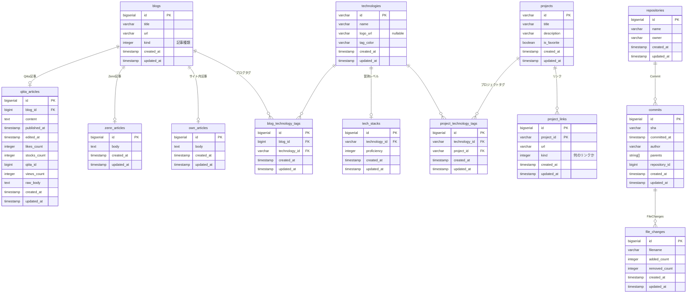

```mermaid
erDiagram
  blogs ||--o| qiita_articles : "Qiita記事"
  blogs ||--o| zenn_articles : "Zenn記事"
  blogs ||--o| own_articles : "サイト内記事"
  blogs ||--o{ blog_technology_tags : "ブログタグ"
  technologies ||--o{ blog_technology_tags : ""
  technologies ||--o| tech_stacks : "習熟レベル"
  technologies ||--o{ project_technology_tags : ""
  projects ||--o{ project_technology_tags : "プロジェクトタグ"
  projects ||--o{ project_links : "リンク"

  blogs {
    bigserial id PK
    varchar title
    varchar url
    integer kind "記事種類"
    timestamp created_at
    timestamp updated_at
  }
  blog_technology_tags {
    bigserial id PK
    bigint blog_id FK
    varchar technology_id FK
    timestamp created_at
    timestamp updated_at
  }
  technologies {
    varchar id PK
    varchar name
    varchar logo_url "nullable"
    varchar tag_color
    timestamp created_at
    timestamp updated_at
  }
  qiita_articles {
    bigserial id PK
    bigint blog_id FK
    text content
    timestamp published_at
    timestamp edited_at
    integer likes_count
    integer stocks_count
    bigint qiita_id
    integer views_count
    text raw_body
    timestamp created_at
    timestamp updated_at
  }
  zenn_articles  {
    bigserial id PK
    text body
    timestamp created_at
    timestamp updated_at
  }
  own_articles {
    bigserial id PK
    text body
    timestamp created_at
    timestamp updated_at
  }
  projects {
    varchar id PK
    varchar title
    varchar description
    boolean is_favorite
    timestamp created_at
    timestamp updated_at
  }
  project_technology_tags {
    bigserial id PK
    varchar technology_id FK
    varchar project_id FK
    timestamp created_at
    timestamp updated_at
  }
  project_links {
    bigserial id PK
    varchar project_id PK
    varchar url
    integer kind "何のリンクか"
    timestamp created_at
    timestamp updated_at
  }
  tech_stacks {
    bigserial id PK
    varchar technology_id FK
    integer proficiency
    timestamp created_at
    timestamp updated_at
  }

  repositories ||--o{ commits: "Commit"
  commits ||--o{ file_changes: "FileChanges"
  repositories {
    bigserial id PK
    varchar name
    varchar owner
    timestamp created_at
    timestamp updated_at
  }
  commits {
    bigserial id PK
    varchar sha
    timestamp committed_at
    varchar author
    string[] parents
    bigint repository_id
    timestamp created_at
    timestamp updated_at
  }
  file_changes {
    bigserial id PK
    varchar filename
    integer added_count
    integer removed_count
    timestamp created_at
    timestamp updated_at
  }
```
